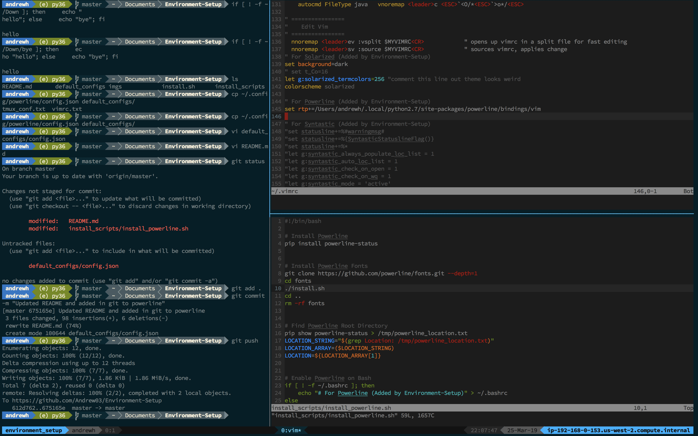

# Environment-Setup

## What it Looks Like


## What's Getting Installed
* [Powerline](https://powerline.readthedocs.io/en/master/), for showing cool `bash` prompts and `vim` footers
* [Solarized](https://ethanschoonover.com/solarized/), a color theme for `vim`
* `Vim`
  * [Pathogen](https://github.com/tpope/vim-pathogen), package manager for `vim`
  * [Auto-Pairs](https://github.com/jiangmiao/auto-pairs), automatic pair insertion or deletion of brackets, parents, quotes for `vim`
  * [LastPlace](https://github.com/farmergreg/vim-lastplace), memory of last edit position on exit for `vim`
* `Tmux`
  * [Tmux Plugin Manager](https://github.com/tmux-plugins/tpm), a plugin manager for `tmux`
  * [Tmux Sensible](https://github.com/tmux-plugins/tmux-sensible), some basic options for `tmux`
  * [Tmux Yank](https://github.com/tmux-plugins/tmux-yank), copy to system clipboard for `tmux`, but it might not work out of the box
  * [Tmux Themepack](https://github.com/jimeh/tmux-themepack), themes for `tmux`

## What Files are Changing?
These files will be created if they don't already exist, but otherwise they will have features appended to them

* ~/.bash.rc
* ~/.vimrc
* ~/.tmux.conf
* ~/.config/powerline/config.json

## Instructions
Right now this repository only works for Mac and Linux Users. If the vim colors look weird after
installation, try commenting out the line that says `let g:solarized_termcolors=256`

1. Install [pip](https://en.wikipedia.org/wiki/Pip_(package_manager))
2. Clone this repository
```
git clone https://github.com/Andrew03/Environment-Setup.git && cd Environment-Setup
```
3. Run the installation (this installs everything listed above by default)
```
bash install.sh
```
